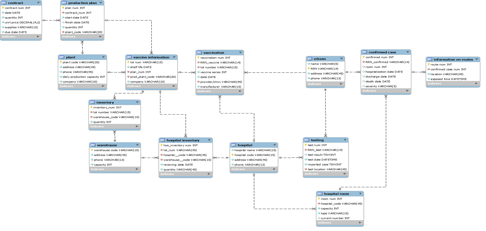
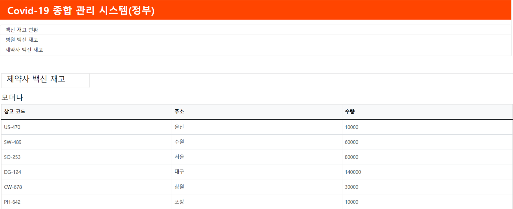
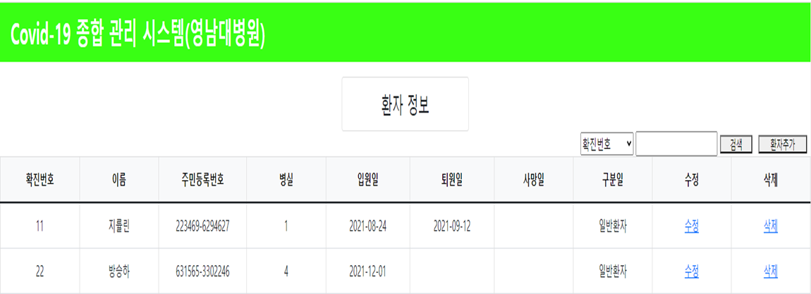
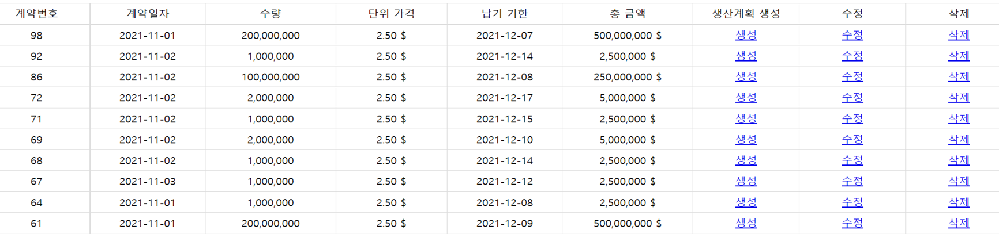

# COVID-19에 대한 종합 관리 시스템

### [프로젝트 소개]

- 정부, 제약사, 병원 3가지의 기관에서의 코로나 환자, 백신 정보를 종합적으로 관리하는 가상 시스템입니다.
- DB는 MySQL을 사용하였으며, PHP언어를 사용하여 화면 구성과 DB연결 및 비즈니스 로직을 구현 하였습니다.
- 정부, 제약사, 병원에서 사용되는 페이지를 각각 구현하였으며 환자나, 백신 재고량등에 대한 정보를 연동되게 구현하였습니다.
- 2021.11.05 ~ 2021.12.01

### [ERD]

### 페이지 화면

- **정부**

  

  - 주로 코로나 환자 관리 및 통계 위주로 구현하였습니다.

- **병원**

  

  - 주로 코로나 환자들과 병원의 재고 관리 위주로 구현하였습니다.

- **제약사**
  
  - 주로 백신 생산과 계약에 관련된 로직들 위주로 구현하였습니다.

### [역할]

- 팀장
- DB 설계 및 정부 기관 구현

### [어려웠던 점]

- 역할 분배가 고르지 못해 자기의 역할에 어려워하는 팀원들이 있어 갈등이 생겼습니다.
- 고른 업무 분배가 아닌 특정 인원에 업무가 가중되었습니다.
- 처음 보는 php라는 언어로 바로 개발에 시작할 때 러닝 커브가 존재하여 어려움을 겪었습니다.

### [개선할 점]

- 개발을 빠르게 진행하기 위해서는 요구사항을 분석하고 ERD를 설계할 때 처음에 좀 더 세밀하게 설계하여야 합니다.
- CSS로 디자인을 하지 못해 추후 CSS를 활용하여 더 나은 UI를 보여주어야 합니다.
- PHP언어만이 아닌 프레임워크를 활용하여 더 생산성이 높게 개발이 진행되어야 합니다.
- 패키지 구조의 개선이 필요합니다.